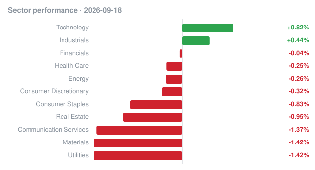

# 📊 Market Radar

A daily, automatically updated record of **insider trading** (SEC Form 4 open-market buys and sales) and **US market performance**, with a weekly recap every Sunday. Collected by GitHub Actions.

**Last updated:** 2026-09-14

## Market close · 2026-09-11

| Index | Close | Change |
|---|---:|---:|
| S&P 500 (SPY) | 764.29 | +0.85% |
| Nasdaq 100 (QQQ) | 714.88 | +0.87% |
| Dow 30 (DIA) | 525.79 | +0.97% |
| Russell 2000 (IWM) | 288.89 | +0.41% |

**Top large-cap gainers:** **CSCO** +4.37% · **IBM** +3.96% · **INTC** +2.61% · **AMD** +2.49% · **CRM** +1.94%  
**Top large-cap decliners:** **UNH** -2.37% · **ORCL** -1.74% · **LLY** -0.65% · **MRK** -0.54% · **JNJ** -0.29%

## Biggest insider buys · filed 2026-09-11

| Company | Insider | Role | Value | Shares | Avg price | Filing |
|---|---|---|---:|---:|---:|---|
| **GPI** GROUP 1 AUTOMOTIVE INC | Conifer Management, L.L.C. | 10% Owner | $23.7M | 84,000 | $281.78 | [Form 4](https://www.sec.gov/Archives/edgar/data/1773994/000090514826004138/0000905148-26-004138-index.htm) |
| **GREE** Vulcan Infrastructure & Power Inc. | Rogers George Ted III | Director | $5.0M | 2,923,976 | $1.71 | [Form 4](https://www.sec.gov/Archives/edgar/data/1881667/000162828026061590/0001628280-26-061590-index.htm) |
| **CRBG** Corebridge Financial, Inc. | NIPPON LIFE INSURANCE CO | 10% Owner | $4.6M | 136,466 | $33.78 | [Form 4](https://www.sec.gov/Archives/edgar/data/1889539/000119312526389292/0001193125-26-389292-index.htm) |
| **ANGX** Angel Studios, Inc. | Sarowitz Steven I | Director | $2.5M | 488,637 | $5.19 | [Form 4](https://www.sec.gov/Archives/edgar/data/1865200/000186520026000085/0001865200-26-000085-index.htm) |
| **USLM** UNITED STATES LIME & MINERALS INC | Candou Holdings Ltd. | 10% Owner | $2.2M | 20,000 | $110.00 | [Form 4](https://www.sec.gov/Archives/edgar/data/2022891/000121390026099266/0001213900-26-099266-index.htm) |
| **CYBN** CYBIN INC. | Glavine Paul | Chief Growth Officer | $1.2M | 100,000 | $12.47 | [Form 4](https://www.sec.gov/Archives/edgar/data/1833141/000091228226001263/0000912282-26-001263-index.htm) |
| **CYBN** CYBIN INC. | So Eric H. L. | Executive Chair, Director | $1.2M | 100,000 | $12.39 | [Form 4](https://www.sec.gov/Archives/edgar/data/1833141/000091228226001261/0000912282-26-001261-index.htm) |
| **PVH** PVH CORP. /DE/ | Larsson Stefan | Chief Executive Officer, Director | $1.0M | 14,179 | $70.53 | [Form 4](https://www.sec.gov/Archives/edgar/data/1558755/000112329226001286/0001123292-26-001286-index.htm) |
| **RLMD** RELMADA THERAPEUTICS, INC. | Shenouda Maged | Chief Financial Officer | $844.0K | 200,000 | $4.22 | [Form 4](https://www.sec.gov/Archives/edgar/data/1553643/000121390026098970/0001213900-26-098970-index.htm) |
| **RLMD** RELMADA THERAPEUTICS, INC. | TRAVERSA SERGIO | Chief Executive Officer, Director | $828.0K | 200,000 | $4.14 | [Form 4](https://www.sec.gov/Archives/edgar/data/1553643/000121390026098969/0001213900-26-098969-index.htm) |

## Biggest insider sales · filed 2026-09-11

| Company | Insider | Role | Value | Shares | Avg price | Filing |
|---|---|---|---:|---:|---:|---|
| **HGTY** Hagerty, Inc. | Hagerty Holding Corp. | 10% Owner | $122.0M | 10,637,500 | $11.47 | [Form 4](https://www.sec.gov/Archives/edgar/data/1899295/000110465926107145/0001104659-26-107145-index.htm) |
| **DELL** Dell Technologies Inc. | Silver Lake Partners IV, L.P., Silver Lake Technology Associates IV, L.P., SLTA IV (GP), L.L.C., Silver Lake Group, L.L.C., Durban Egon | Director, 10% Owner | $29.5M | 54,608 | $540.18 | [Form 4](https://www.sec.gov/Archives/edgar/data/1571996/000119312526389498/0001193125-26-389498-index.htm) |
| **DELL** Dell Technologies Inc. | SL SPV-2, L.P., SLTA SPV-2, L.P., SLTA SPV-2 (GP), L.L.C., Silver Lake Group, L.L.C., Durban Egon | Director, 10% Owner | $26.0M | 48,097 | $540.39 | [Form 4](https://www.sec.gov/Archives/edgar/data/1571996/000119312526389488/0001193125-26-389488-index.htm) |
| **PBF** PBF Energy Inc. | Control Empresarial de Capitales S.A. de C.V. | 10% Owner | $24.8M | 319,270 | $77.77 | [Form 4](https://www.sec.gov/Archives/edgar/data/1273693/000114036126036396/0001140361-26-036396-index.htm) |
| **HNGE** Hinge Health, Inc. | Perez Daniel Antonio | CEO & Co-Founder, Director, 10% Owner | $22.4M | 250,000 | $89.45 | [Form 4](https://www.sec.gov/Archives/edgar/data/1673743/000206323626000014/0002063236-26-000014-index.htm) |

Full list: [`data/insider/2026/09/2026-09-11.md`](data/insider/2026/09/2026-09-11.md)

## How it works

- [`scripts/update.py`](scripts/update.py) (Python stdlib only) runs daily via [`.github/workflows/daily.yml`](.github/workflows/daily.yml).
- **Insider trades:** reads SEC EDGAR's daily index, parses every Form 4, and keeps open-market purchases (code `P`) and sales (code `S`).
- **Market:** closing prices for major index ETFs, the 11 S&P sector ETFs, and 40 large-cap stocks.
- **Weekly recap:** every Sunday, including cluster buys (multiple insiders buying the same company).
- Raw JSON lives in [`data/`](data) for anyone who wants to analyze it.

_Informational only, not investment advice. Data: SEC EDGAR (Form 4) and Yahoo Finance; may contain errors or delays._
