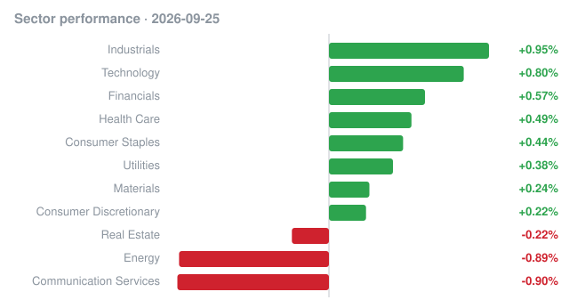

# 📊 Market Radar

An automatically updated record of **insider trading** (SEC Form 4 open-market buys and sales) and **US market performance**, updated every weekday with a recap each Monday. Collected by GitHub Actions.

**Last updated:** 2026-10-07

## Market close · 2026-10-07

| Index | Close | Change |
|---|---:|---:|
| S&P 500 (SPY) | 777.22 | -0.24% |
| Nasdaq 100 (QQQ) | 757.73 | -0.25% |
| Dow 30 (DIA) | 511.02 | -0.69% |
| Russell 2000 (IWM) | 277.70 | -1.29% |

**Top large-cap gainers:** **LLY** +2.70% · **ABBV** +1.75% · **NFLX** +1.47% · **JNJ** +1.44% · **AMZN** +1.42%  
**Top large-cap decliners:** **META** -2.38% · **ADBE** -2.25% · **GE** -1.86% · **PEP** -1.58% · **WFC** -1.53%

## Biggest insider buys · filed 2026-10-06

| Company | Insider | Role | Value | Shares | Avg price | Filing |
|---|---|---|---:|---:|---:|---|
| Keenova Therapeutics plc | GOLDENTREE ASSET MANAGEMENT LP, GoldenTree Asset Management LLC, Tananbaum Steven A. | 10% Owner | $42.1M | 463,000 | $91.00 | [Form 4](https://www.sec.gov/Archives/edgar/data/1278951/000149315226045958/0001493152-26-045958-index.htm) |
| **PSUS** Pershing Square USA, Ltd. | ISRAEL RYAN | Chief Investment Officer | $9.6M | 256,613 | $37.47 | [Form 4](https://www.sec.gov/Archives/edgar/data/1597463/000119312526415861/0001193125-26-415861-index.htm) |
| **AVR** Anteris Technologies Global Corp. | L1 Capital Pty Ltd | 10% Owner | $6.7M | 884,809 | $7.58 | [Form 4](https://www.sec.gov/Archives/edgar/data/2011514/000181764626000029/0001817646-26-000029-index.htm) |
| **CRBG** Corebridge Financial, Inc. | NIPPON LIFE INSURANCE CO | 10% Owner | $6.4M | 187,155 | $34.27 | [Form 4](https://www.sec.gov/Archives/edgar/data/1889539/000119312526415632/0001193125-26-415632-index.htm) |
| **BORR** Borr Drilling Ltd | Troim Tor Olav | Director | $6.2M | 1,500,000 | $4.13 | [Form 4](https://www.sec.gov/Archives/edgar/data/1715497/000162828026065174/0001628280-26-065174-index.htm) |
| **AXIA3** AXIA Energia S.A. | Batista de Lima Filho Pedro | Director | $5.3M | 489,900 | $10.81 | [Form 4](https://www.sec.gov/Archives/edgar/data/1439124/000121390026107316/0001213900-26-107316-index.htm) |
| **QVCG** QVC Group, Inc. | GOLDENTREE ASSET MANAGEMENT LP, GoldenTree Asset Management LLC, Tananbaum Steven A. | 10% Owner | $3.5M | 250,000 | $13.85 | [Form 4](https://www.sec.gov/Archives/edgar/data/1278951/000149315226045954/0001493152-26-045954-index.htm) |
| **LWAY** Lifeway Foods, Inc. | Divisadero Street Capital Management, LP, Divisadero Street Partners GP, LLC, Zolezzi William, Divisadero Street Partners, L.P., Divisadero Street Capital, LLC | 10% Owner | $2.2M | 103,684 | $20.92 | [Form 4](https://www.sec.gov/Archives/edgar/data/1901865/000091957426006685/0000919574-26-006685-index.htm) |
| **SAH** SONIC AUTOMOTIVE INC | Rusnak Paul P. | 10% Owner | $1.7M | 27,756 | $59.76 | [Form 4](https://www.sec.gov/Archives/edgar/data/1460471/000146047126000006/0001460471-26-000006-index.htm) |
| **SAH** SONIC AUTOMOTIVE INC | Rusnak Paul P. | 10% Owner | $1.3M | 21,645 | $59.50 | [Form 4](https://www.sec.gov/Archives/edgar/data/1460471/000146047126000005/0001460471-26-000005-index.htm) |

## Biggest insider sales · filed 2026-10-06

| Company | Insider | Role | Value | Shares | Avg price | Filing |
|---|---|---|---:|---:|---:|---|
| **MDLN** Medline Inc. | GIC Private Ltd, GIC Special Investments Pte Ltd, Hux Investment Pte. Ltd. | 10% Owner | $721.6M | 20,678,630 | $34.90 | [Form 4](https://www.sec.gov/Archives/edgar/data/936828/000119312526416053/0001193125-26-416053-index.htm) |
| **ESTC** Elastic N.V. | Schuurman Steven | Director | $135.2M | 1,500,000 | $90.13 | [Form 4](https://www.sec.gov/Archives/edgar/data/1707753/000112329226001368/0001123292-26-001368-index.htm) |
| **NBIS** Nebius Group N.V. | Nave Ophir | COO, Director | $117.8M | 500,000 | $235.53 | [Form 4](https://www.sec.gov/Archives/edgar/data/2060551/000151384526000126/0001513845-26-000126-index.htm) |
| **RITE** MINERALRITE Corp | Hendricks Lloyd Bernard III | 10% Owner | $106.7M | 3,919,388 | $27.23 | [Form 4](https://www.sec.gov/Archives/edgar/data/2069861/000206986126000007/0002069861-26-000007-index.htm) |
| **S** SentinelOne, Inc. | Weingarten Tomer | President, CEO, Director | $13.3M | 527,368 | $25.26 | [Form 4](https://www.sec.gov/Archives/edgar/data/1583708/000186622226000043/0001866222-26-000043-index.htm) |

Full list: [`data/insider/2026/10/2026-10-06.md`](data/insider/2026/10/2026-10-06.md)

## Latest weekly recap

[2026-W40](data/weekly/2026-W40.md)

## How it works

- [`scripts/update.py`](scripts/update.py) (Python stdlib only) runs every weekday via [`.github/workflows/daily.yml`](.github/workflows/daily.yml).
- **Insider trades:** reads SEC EDGAR's daily index, parses every Form 4, and keeps open-market purchases (code `P`) and sales (code `S`).
- **Market:** closing prices for major index ETFs, the 11 S&P sector ETFs, and 40 large-cap stocks.
- **Weekly recap:** every Monday, covering the week just ended, including cluster buys (multiple insiders buying the same company).
- Raw JSON lives in [`data/`](data) for anyone who wants to analyze it.

_Informational only, not investment advice. Data: SEC EDGAR (Form 4) and Yahoo Finance; may contain errors or delays._
