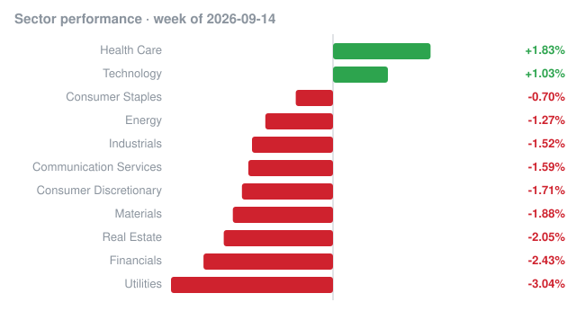

# Weekly recap · 2026-09-14 to 2026-09-18

## Market

| Index | Week change |
|---|---:|
| S&P 500 (SPY) | -0.34% |
| Nasdaq 100 (QQQ) | +0.92% |
| Dow 30 (DIA) | -1.88% |
| Russell 2000 (IWM) | -1.66% |

## Biggest insider buys this week

| Company | Insider | Role | Value | Shares | Avg price | Filing |
|---|---|---|---:|---:|---:|---|
| **RSG** REPUBLIC SERVICES, INC. | CASCADE INVESTMENT, L.L.C., GATES WILLIAM H III | 10% Owner | $129.3M | 580,810 | $222.63 | [Form 4](https://www.sec.gov/Archives/edgar/data/1052192/000110465926107592/0001104659-26-107592-index.htm) |
| **FTK** FLOTEK INDUSTRIES INC/CN/ | Wilks Matthew | Director | $34.3M | 1,319,493 | $26.01 | [Form 4](https://www.sec.gov/Archives/edgar/data/928054/000110465926108024/0001104659-26-108024-index.htm) |
| **USO** United States Oil Fund, LP | HRT FINANCIAL LP | 10% Owner | $16.6M | 105,195 | $157.88 | [Form 4](https://www.sec.gov/Archives/edgar/data/1475597/000147559726000246/0001475597-26-000246-index.htm) |
| **PMTS** CPI Card Group Inc. | Tricor PMT25 Holdings Inc., Tricor Pacific Capital Inc. | 10% Owner | $11.3M | 525,000 | $21.50 | [Form 4](https://www.sec.gov/Archives/edgar/data/1641614/000110465926107610/0001104659-26-107610-index.htm) |
| **CRBG** Corebridge Financial, Inc. | NIPPON LIFE INSURANCE CO | 10% Owner | $11.2M | 320,785 | $35.02 | [Form 4](https://www.sec.gov/Archives/edgar/data/1889539/000119312526395554/0001193125-26-395554-index.htm) |
| **CRBG** Corebridge Financial, Inc. | NIPPON LIFE INSURANCE CO | 10% Owner | $10.3M | 295,967 | $34.86 | [Form 4](https://www.sec.gov/Archives/edgar/data/1889539/000119312526393133/0001193125-26-393133-index.htm) |
| **FOX** Fox Corp | MURDOCH LACHLAN K | Executive Chair, CEO, Director | $10.3M | 149,934 | $68.53 | [Form 4](https://www.sec.gov/Archives/edgar/data/1754301/000162828026062330/0001628280-26-062330-index.htm) |
| 5C Lending Partners Corp. | LIBERTY MUTUAL HOLDING Co INC. | 10% Owner | $9.8M | 398,774 | $24.48 | [Form 4](https://www.sec.gov/Archives/edgar/data/1998387/000119312526395720/0001193125-26-395720-index.htm) |
| Privacore VPC Asset Backed Credit Fund | BANKERS LIFE & CASUALTY CO | 10% Owner | $8.0M | 785,083 | $10.19 | [Form 4](https://www.sec.gov/Archives/edgar/data/903939/000090393926000030/0000903939-26-000030-index.htm) |
| **CRBG** Corebridge Financial, Inc. | NIPPON LIFE INSURANCE CO | 10% Owner | $7.4M | 210,903 | $35.02 | [Form 4](https://www.sec.gov/Archives/edgar/data/1889539/000119312526394389/0001193125-26-394389-index.htm) |
| **USO** United States Oil Fund, LP | HRT FINANCIAL LP | 10% Owner | $6.8M | 43,638 | $155.30 | [Form 4](https://www.sec.gov/Archives/edgar/data/1475597/000147559726000248/0001475597-26-000248-index.htm) |
| **ARDC** Ares Dynamic Credit Allocation Fund, Inc. | THRIVENT FINANCIAL FOR LUTHERANS | 10% Owner | $6.0M | 240,000 | $25.00 | [Form 4](https://www.sec.gov/Archives/edgar/data/1515324/000031498426000042/0000314984-26-000042-index.htm) |
| **CRBG** Corebridge Financial, Inc. | NIPPON LIFE INSURANCE CO | 10% Owner | $6.0M | 176,300 | $34.01 | [Form 4](https://www.sec.gov/Archives/edgar/data/1889539/000119312526390651/0001193125-26-390651-index.htm) |
| **CRBG** Corebridge Financial, Inc. | NIPPON LIFE INSURANCE CO | 10% Owner | $5.9M | 171,144 | $34.61 | [Form 4](https://www.sec.gov/Archives/edgar/data/1889539/000119312526391947/0001193125-26-391947-index.htm) |
| **AXIA3** AXIA Energia S.A. | Batista de Lima Filho Pedro | Director | $5.4M | 512,900 | $10.49 | [Form 4](https://www.sec.gov/Archives/edgar/data/1439124/000121390026100498/0001213900-26-100498-index.htm) |

## Cluster buys

Companies where two or more insiders bought shares this week.

| Company | Insiders buying | Total value |
|---|---:|---:|
| **XBP** XBP Global Holdings, Inc. | 15 | $2.4M |
| **SBLK** Star Bulk Carriers Corp. | 8 | $6.9M |
| **PMTS** CPI Card Group Inc. | 6 | $12.0M |
| **FLNT** Fluent, Inc. | 6 | $83.7K |
| **RVSB** RIVERVIEW BANCORP INC | 5 | $51.1K |
| **BGDE** Big Digital Energy, Inc. | 5 | $21.1K |
| **RWT** REDWOOD TRUST INC | 4 | $928.3K |
| **LMB** Limbach Holdings, Inc. | 4 | $515.9K |
| **BUKS** BUTLER NATIONAL CORP | 4 | $267.3K |
| **EML** EASTERN CO | 4 | $118.0K |
| **JCTC** JEWETT CAMERON TRADING CO LTD | 4 | $46.1K |
| **CBKM** CONSUMERS BANCORP INC /OH/ | 4 | $25.9K |
| **MNR** MACH NATURAL RESOURCES LP | 3 | $2.4M |
| **BWMX** BETTERWARE DE MEXICO, S.A.P.I. DE C.V | 3 | $2.3M |
| **COO** COOPER COMPANIES, INC. | 3 | $1.9M |

_Informational only, not investment advice. Data: SEC EDGAR (Form 4) and Yahoo Finance; may contain errors or delays._
