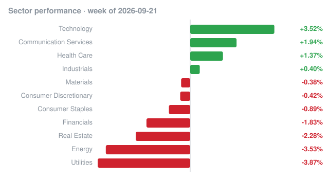

# Weekly recap · 2026-09-21 to 2026-09-25

## Market

| Index | Week change |
|---|---:|
| S&P 500 (SPY) | +1.27% |
| Nasdaq 100 (QQQ) | +3.19% |
| Dow 30 (DIA) | +0.31% |
| Russell 2000 (IWM) | -0.75% |

## Biggest insider buys this week

| Company | Insider | Role | Value | Shares | Avg price | Filing |
|---|---|---|---:|---:|---:|---|
| **LEN, LEN.B** LENNAR CORP /NEW/ | BERKSHIRE HATHAWAY INC, BUFFETT WARREN E | 10% Owner | $212.4M | 2,743,529 | $77.42 | [Form 4](https://www.sec.gov/Archives/edgar/data/1067983/000119312526397059/0001193125-26-397059-index.htm) |
| **LEN** LENNAR CORP /NEW/ | BERKSHIRE HATHAWAY INC, BUFFETT WARREN E | 10% Owner | $136.4M | 1,679,700 | $81.19 | [Form 4](https://www.sec.gov/Archives/edgar/data/1067983/000119312526403089/0001193125-26-403089-index.htm) |
| **GRAB** Grab Holdings Ltd | Tan Anthony Ping Yeow | Chief Executive Officer, Director | $29.9M | 10,350,000 | $2.89 | [Form 4](https://www.sec.gov/Archives/edgar/data/1855612/000189649726000009/0001896497-26-000009-index.htm) |
| **GSAT** Globalstar, Inc. | Monroe James III | Director, 10% Owner | $29.8M | 361,600 | $82.52 | [Form 4](https://www.sec.gov/Archives/edgar/data/1366868/000137966426000002/0001379664-26-000002-index.htm) |
| **GME** GameStop Corp. | Cohen Ryan | President, CEO and Chairman, Director | $26.4M | 1,150,680 | $22.94 | [Form 4](https://www.sec.gov/Archives/edgar/data/1767470/000092189526002608/0000921895-26-002608-index.htm) |
| **LNBIX** Lincoln Bain Capital Total Credit Fund | Lincoln Financial Investments Corp | 10% Owner | $25.0M | 2,460,630 | $10.16 | [Form 4](https://www.sec.gov/Archives/edgar/data/2054992/000119312526396327/0001193125-26-396327-index.htm) |
| **ETRA** Electra Therapeutics, Inc. | ORBIMED ADVISORS LLC, OrbiMed Capital GP VII LLC, OrbiMed Genesis GP LLC | Director, 10% Owner | $20.0M | 1,333,333 | $15.00 | [Form 4](https://www.sec.gov/Archives/edgar/data/2088082/000094787126000880/0000947871-26-000880-index.htm) |
| **ETRA** Electra Therapeutics, Inc. | GORDON CARL L | Director, 10% Owner | $20.0M | 1,333,333 | $15.00 | [Form 4](https://www.sec.gov/Archives/edgar/data/2088082/000094787126000881/0000947871-26-000881-index.htm) |
| **GPI** GROUP 1 AUTOMOTIVE INC | Conifer Management, L.L.C. | 10% Owner | $16.9M | 65,650 | $256.78 | [Form 4](https://www.sec.gov/Archives/edgar/data/1773994/000090514826004241/0000905148-26-004241-index.htm) |
| **CRBG** Corebridge Financial, Inc. | NIPPON LIFE INSURANCE CO | 10% Owner | $10.2M | 296,868 | $34.31 | [Form 4](https://www.sec.gov/Archives/edgar/data/1889539/000119312526401049/0001193125-26-401049-index.htm) |
| **CV** CapsoVision, Inc | HARARI ELIYAHOU ET AL | 10% Owner | $10.0M | 1,757,469 | $5.69 | [Form 4](https://www.sec.gov/Archives/edgar/data/1378325/000100916526000009/0001009165-26-000009-index.htm) |
| **CRBG** Corebridge Financial, Inc. | NIPPON LIFE INSURANCE CO | 10% Owner | $7.5M | 219,273 | $34.13 | [Form 4](https://www.sec.gov/Archives/edgar/data/1889539/000119312526402895/0001193125-26-402895-index.htm) |
| Calamos Aksia Hedged Strategies Fund | Calamos Aksia Hedged Strategies Fund (Offshore), Ltd. | 10% Owner | $7.5M | 714,183 | $10.47 | [Form 4](https://www.sec.gov/Archives/edgar/data/2063706/000212577326000013/0002125773-26-000013-index.htm) |
| **CRBG** Corebridge Financial, Inc. | NIPPON LIFE INSURANCE CO | 10% Owner | $7.5M | 212,828 | $35.08 | [Form 4](https://www.sec.gov/Archives/edgar/data/1889539/000119312526399477/0001193125-26-399477-index.htm) |
| **GSHD** Goosehead Insurance, Inc. | Durable Capital Partners LP | 10% Owner | $7.1M | 150,000 | $47.32 | [Form 4](https://www.sec.gov/Archives/edgar/data/1798849/000119312526401141/0001193125-26-401141-index.htm) |

## Cluster buys

Companies where two or more insiders bought shares this week.

| Company | Insiders buying | Total value |
|---|---:|---:|
| **BBD** BANK BRADESCO | 21 | $27.0M |
| Blackstone Private Real Estate Credit & Income Fund | 16 | $10.0M |
| Blackstone Multi-Strategy Hedge Fund L.P. | 8 | $9.8M |
| **SPRU** SPRUCE POWER HOLDING CORP | 7 | $107.7K |
| **BGDE** Big Digital Energy, Inc. | 5 | $7.9K |
| **ETRA** Electra Therapeutics, Inc. | 4 | $40.0M |
| **JCTC** JEWETT CAMERON TRADING CO LTD | 4 | $21.1K |
| **ENHA** Enhanced Group Inc. | 3 | $7.0M |
| **GAM** GENERAL AMERICAN INVESTORS CO INC | 3 | $387.4K |
| **RGCO** RGC RESOURCES INC | 3 | $85.1K |
| **LEN, LEN.B** LENNAR CORP /NEW/ | 2 | $212.4M |
| **LEN** LENNAR CORP /NEW/ | 2 | $136.4M |
| **GRAB** Grab Holdings Ltd | 2 | $30.7M |
| **GME** GameStop Corp. | 2 | $26.8M |
| **NYAX** Nayax Ltd. | 2 | $4.8M |

_Informational only, not investment advice. Data: SEC EDGAR (Form 4) and Yahoo Finance; may contain errors or delays._
