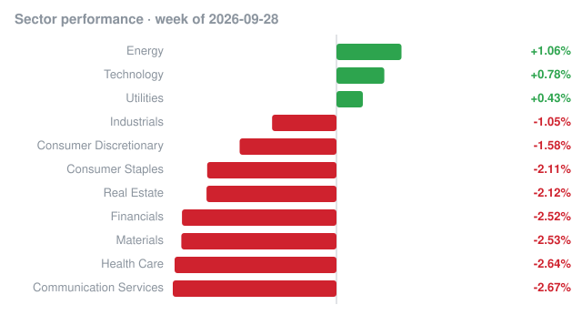

# Weekly recap · 2026-09-28 to 2026-10-02

## Market

| Index | Week change |
|---|---:|
| S&P 500 (SPY) | -0.95% |
| Nasdaq 100 (QQQ) | -0.33% |
| Dow 30 (DIA) | -1.71% |
| Russell 2000 (IWM) | -1.05% |

## Biggest insider buys this week

| Company | Insider | Role | Value | Shares | Avg price | Filing |
|---|---|---|---:|---:|---:|---|
| **SLBT** SL Science Holding Ltd | Wang Ching-Dong | Chief Executive Officer, Director, 10% Owner | $10329.9B | 4,545,306 | $2,272,653.00 | [Form 4](https://www.sec.gov/Archives/edgar/data/2070534/000110465926112844/0001104659-26-112844-index.htm) |
| **UUU** UNIVERSAL SAFETY PRODUCTS, INC. | AULT MILTON C III | Director, 10% Owner | $92.4M | 18,000 | $5,134.00 | [Form 4](https://www.sec.gov/Archives/edgar/data/1212502/000121465926012438/0001214659-26-012438-index.htm) |
| **GPI** GROUP 1 AUTOMOTIVE INC | Conifer Management, L.L.C. | 10% Owner | $66.3M | 273,712 | $242.15 | [Form 4](https://www.sec.gov/Archives/edgar/data/1773994/000090514826004310/0000905148-26-004310-index.htm) |
| **KOD** Kodiak Sciences Inc. | BAKER BROS. ADVISORS LP, 667, L.P., Baker Bros. Advisors (GP) LLC, Baker Brothers Life Sciences LP, BAKER FELIX, BAKER JULIAN | Director, 10% Owner | $63.4M | 715,592 | $88.59 | [Form 4](https://www.sec.gov/Archives/edgar/data/1551139/000119312526409127/0001193125-26-409127-index.htm) |
| **KOD** Kodiak Sciences Inc. | BAKER BROS. ADVISORS LP, 667, L.P., Baker Bros. Advisors (GP) LLC, Baker Brothers Life Sciences LP, BAKER FELIX, BAKER JULIAN | Director, 10% Owner | $58.6M | 807,840 | $72.57 | [Form 4](https://www.sec.gov/Archives/edgar/data/1551139/000119312526409116/0001193125-26-409116-index.htm) |
| **LEN** LENNAR CORP /NEW/ | BERKSHIRE HATHAWAY INC, BUFFETT WARREN E | 10% Owner | $53.9M | 660,410 | $81.59 | [Form 4](https://www.sec.gov/Archives/edgar/data/1067983/000119312526409451/0001193125-26-409451-index.htm) |
| Hamilton Lane Credit Income Fund | HAMILTON LANE ADVISORS LLC | 10% Owner | $37.2M | 3,677,869 | $10.11 | [Form 4](https://www.sec.gov/Archives/edgar/data/1573767/000121390026105358/0001213900-26-105358-index.htm) |
| **KOD** Kodiak Sciences Inc. | BAKER BROS. ADVISORS LP, 667, L.P., Baker Bros. Advisors (GP) LLC, Baker Brothers Life Sciences LP, BAKER FELIX, BAKER JULIAN | Director, 10% Owner | $35.0M | 418,323 | $83.58 | [Form 4](https://www.sec.gov/Archives/edgar/data/1551139/000119312526409118/0001193125-26-409118-index.htm) |
| **GPI** GROUP 1 AUTOMOTIVE INC | Conifer Management, L.L.C. | 10% Owner | $31.5M | 126,288 | $249.62 | [Form 4](https://www.sec.gov/Archives/edgar/data/1773994/000090514826004278/0000905148-26-004278-index.htm) |
| John Hancock GA Senior Loan Trust | Manufacturers Life Reinsurance Ltd | 10% Owner | $31.0M | 1,931,123 | $16.05 | [Form 4](https://www.sec.gov/Archives/edgar/data/1742951/000176549626000018/0001765496-26-000018-index.htm) |
| **CRBG** Corebridge Financial, Inc. | NIPPON LIFE INSURANCE CO | 10% Owner | $27.5M | 805,782 | $34.15 | [Form 4](https://www.sec.gov/Archives/edgar/data/1889539/000119312526409206/0001193125-26-409206-index.htm) |
| **ADRX** ADARx Pharmaceuticals, Inc. | George Simeon | Director, 10% Owner | $27.2M | 1,600,000 | $17.00 | [Form 4](https://www.sec.gov/Archives/edgar/data/1802369/000119312526408061/0001193125-26-408061-index.htm) |
| **ADRX** ADARx Pharmaceuticals, Inc. | SR ONE CAPITAL MANAGEMENT, LLC | 10% Owner | $27.2M | 1,600,000 | $17.00 | [Form 4](https://www.sec.gov/Archives/edgar/data/1802369/000119312526408064/0001193125-26-408064-index.htm) |
| John Hancock GA Mortgage Trust | Manulife (International) Ltd | 10% Owner | $26.0M | 1,476,118 | $17.61 | [Form 4](https://www.sec.gov/Archives/edgar/data/1742952/000176551826000006/0001765518-26-000006-index.htm) |
| AGL Private Credit Income Fund | Abu Dhabi Investment Authority, Platinum International Investment Holding RSC Ltd, Platinum Falcon B 2018 RSC Ltd, Platinum Bird C 2024 RSC Ltd | 10% Owner | $22.4M | 955,609 | $23.42 | [Form 4](https://www.sec.gov/Archives/edgar/data/2011498/000119312526409304/0001193125-26-409304-index.htm) |

## Cluster buys

Companies where two or more insiders bought shares this week.

| Company | Insiders buying | Total value |
|---|---:|---:|
| **SPG** SIMON PROPERTY GROUP INC. | 11 | $460.7K |
| **ADRX** ADARx Pharmaceuticals, Inc. | 9 | $87.7M |
| Fortress Net Lease REIT | 8 | $20.0M |
| **FUL** FULLER H B CO | 7 | $621.3K |
| **KOD** Kodiak Sciences Inc. | 6 | $157.0M |
| AGL Private Credit Income Fund | 6 | $22.4M |
| **MPB** MID PENN BANCORP INC | 6 | $27.4K |
| **COUR** Coursera, Inc. | 5 | $11.4M |
| **PRHI** Presurance Holdings, Inc. | 5 | $248.9K |
| **TRCK** Track Group, Inc. | 5 | $230.4K |
| John Hancock GA Mortgage Trust | 4 | $40.0M |
| NC SLF Inc. | 4 | $10.1M |
| **BBASX** AMG BBH Asset-Backed Credit Fund, LLC | 4 | $4.1M |
| **JCTC** JEWETT CAMERON TRADING CO LTD | 4 | $30.6K |
| **AUBN** AUBURN NATIONAL BANCORPORATION, INC | 4 | $5.4K |

_Informational only, not investment advice. Data: SEC EDGAR (Form 4) and Yahoo Finance; may contain errors or delays._
